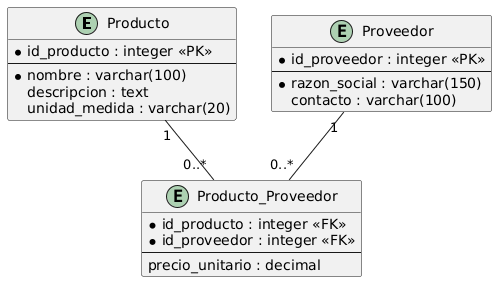

# Conceptos Transversales

## Modelo de datos - Módulo de Compras

A continuación se presenta el diagrama entidad-relación (MER) correspondiente a las entidades principales del Módulo de Compras: Producto, Proveedor, y la relación entre ambos.

## Descripción de las entidades

### Producto

Representa un artículo del catálogo. Contiene el identificador único, nombre, descripción y unidad de medida.

### Proveedor

Representa una empresa o persona externa que suministra productos. Contiene el identificador único, razón social y datos de contacto.

### Producto_Proveedor

Tabla intermedia que resuelve la relación muchos a muchos entre Producto y Proveedor, permitiendo que un mismo producto tenga varios proveedores y que cada asociación tenga su propio precio unitario.
